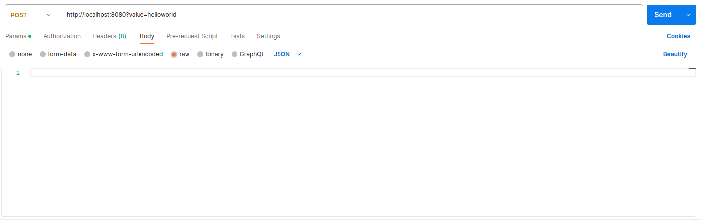

## About test-t1consulting

test-t1consulting - веб-приложение, принимающее входные данные в виде строки и в результате дающее частоту появления символов в строке.
test-t1consulting работает как с гипермедией, так и с прямыми запросами с API-платформ.

## Requirements

- Java 8+
- Apache Maven 3.9+

## Starting

- Открыть терминал и перейти в директорию проекта.
- Выполнить команду mvn spring-boot:run
- Удачное разверывание проекта должно выглядеть так:

## Constraints

Ограничение входных данных:
1) Не использовать числовые типы данных (integer, float, double).
2) Максимум в строке 100 символов.
3) Минимум в строке 1 символ.

- Входные данные: String.
- Выходные данные: JSON.

## Using

Использовать приложение можно двумя способами: 
1) Через гипермедиа

1.1) Открыть браузер на адресе localhost:8080, в окошко ввода информации ввести нужные данные и нажать кнопку 'send'

1.2) Если строка не нарушает ограничений, то в таком случае вернется ответ в виде JSON

2) Через API-платформу

2.1) Составить POST-запрос с параметрами в адресной строке через ключ 'value'

2.2) Если значение не нарушает ограничений, то в таком случае вернется ответ в виде JSON

В случае нарушения ограничений приложение выдаст ошибку 400 Bad Request с описанием.

